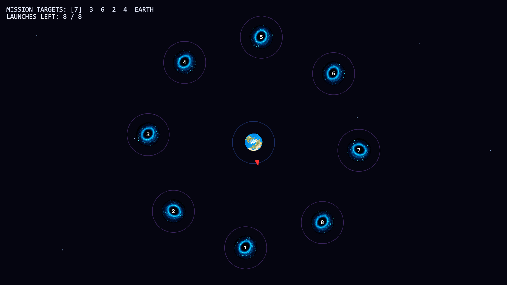
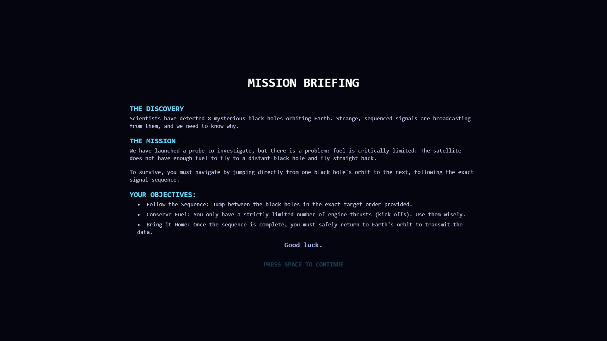
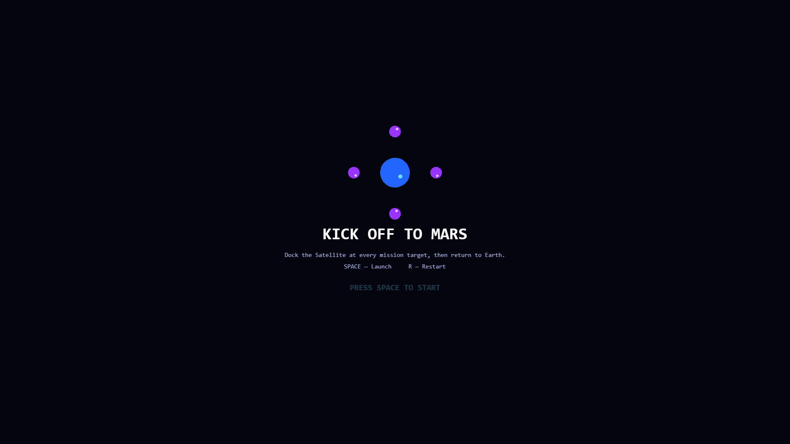
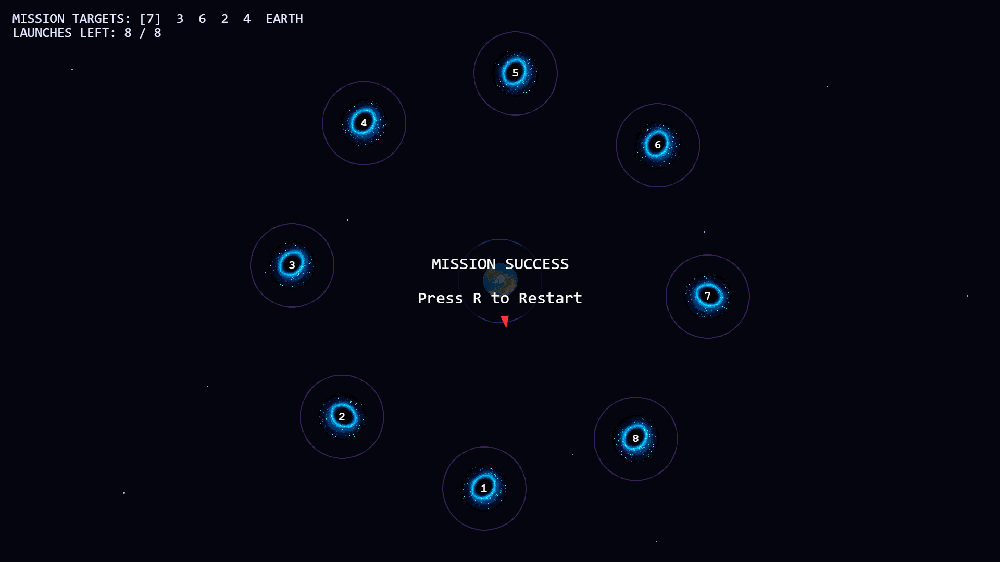
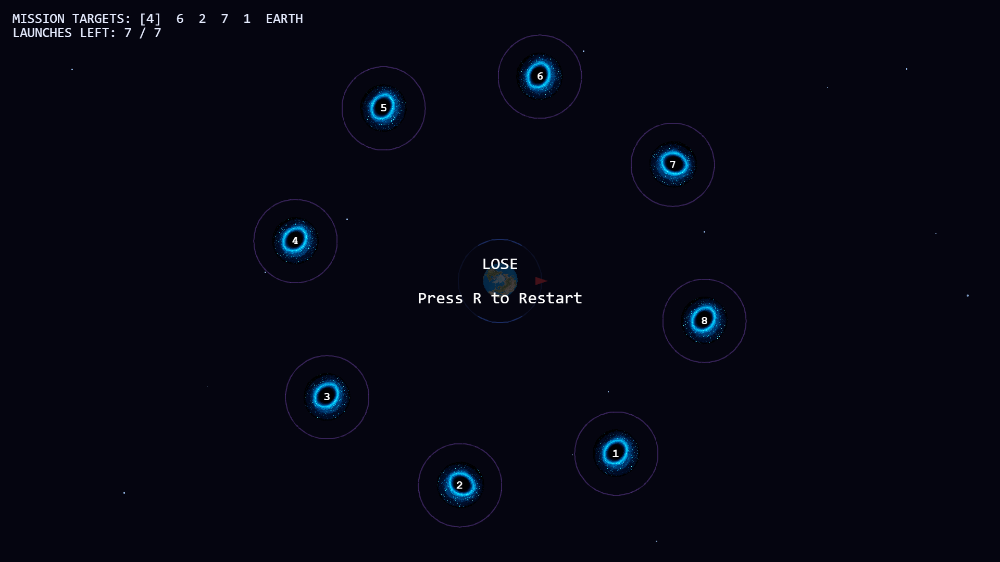
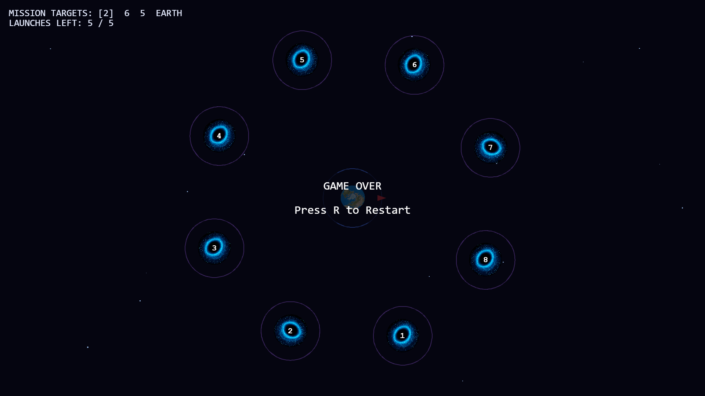

# Kick Off to Mars

A browser-based orbital mechanics puzzle game built with [Phaser 3](https://phaser.io/). Dock a satellite at a sequence of black holes in the exact order given, using a strictly limited number of engine burns, then bring it home to Earth.

There is no physics engine involved — every orbit, launch trajectory, and capture check is explicit vector math computed by hand each frame.



## Story

Scientists have detected 8 mysterious black holes orbiting Earth, broadcasting strange, sequenced signals. A probe has been launched to investigate — but fuel is critically limited. It can't fly out to a distant black hole and straight back; it has to hop from orbit to orbit, following the signal sequence exactly, before finally returning home to transmit the data.

## How to Play

1. The satellite starts in orbit around Earth. Press **SPACE** to launch it in a straight line, in whatever direction it's currently facing.
2. Flying into a black hole's docking ring captures the satellite into orbit around it.
3. **A black hole only counts as "visited" once the satellite completes one full orbital revolution around it.** Leaving early (launching again before the lap finishes) means that target is *not* credited, even though the mission sequence keeps going.
4. Repeat until every target in the mission sequence has been visited, then fly back and dock at Earth to complete the mission.
5. You have a limited number of launches — spend them carefully. Every mission run grants one launch per target, one to return home, plus a bonus launch for each pair of back-to-back targets that sit diametrically opposite each other (crossing straight past Earth wastes momentum, so it's compensated for).

### Controls

The game is fully playable with either a keyboard or a touchscreen.

| Action | Keyboard | Touch / Mouse |
| --- | --- | --- |
| Advance the briefing / start the game | `SPACE` | Tap anywhere |
| Launch the satellite out of its current orbit | `SPACE` | Tap anywhere |
| Restart (once an end screen is showing) | `R` | Tap anywhere |

Launching is ignored while the satellite is already in flight, or when no launches remain — for both input methods.

### Playing on mobile

Android and other touch devices are supported. The game is a fixed 16:9 canvas, so **hold your device in landscape** — in portrait it would be squeezed into an unplayably thin strip, and a prompt asking you to rotate is shown instead.

### Win / Lose conditions

- **MISSION SUCCESS** — every black hole in the sequence was fully orbited, in order, and the satellite made it back to Earth's orbit.
- **LOSE** — launches run out before the mission is complete (e.g. a black hole was left before finishing its required lap). The run failed, but nothing catastrophic happened to the satellite.
- **GAME OVER** — the satellite flies off the edge of the screen during flight. A fatal navigation error, distinct from simply running out of fuel.

## Screenshots

| Mission Briefing | Main Menu |
| --- | --- |
|  |  |

| Mission Success | Lose | Game Over |
| --- | --- | --- |
|  |  |  |

## Running Locally

This is a static, single-page app with no build step. Any static file server will do, for example:

```bash
python3 -m http.server 8000
```

Then open `http://localhost:8000` in a browser.

## Project Structure

```
.
├── index.html      # Page shell, loads Phaser from CDN and main.js
├── style.css        # Fullscreen canvas layout + HUD styling
├── main.js          # All game logic: scenes, satellite state machine, mission system
├── res/              # Art assets (earth.png, blackhole.png) — optional; the game
│                     # falls back to primitive-shape placeholders if these are missing
├── audio/            # bg.wav — looping background music (optional; silent if absent)
└── screenshots/      # Screenshots used in this README
```

## Technical Notes

- **No physics engine.** Orbits are parametric (`center + radius * cos/sin(angle)`); flight is straight-line velocity integration (`position += velocity * dt`); capture/proximity checks use `Phaser.Math.Distance.Between`. This keeps every interaction fully deterministic and easy to reason about.
- **Custom particle effects.** A starfield background, a directional engine exhaust trail (emitted from the middle of the satellite's rear edge, opposite its direction of travel), and a capture burst all share one generated particle texture.
- **Scene flow:** `StoryScene` (mission briefing) → `MenuScene` (title screen) → `MainScene` (gameplay).
- **Background music** is a single looping track owned at module scope, not by a scene, so it plays continuously across screen changes instead of restarting. Browsers block audio until the first user gesture, so it begins on the player's first tap or keypress.
- **Graceful asset fallback:** if `res/earth.png` or `res/blackhole.png` fail to load, the game substitutes simple circle/triangle placeholders instead of breaking.

## Built With

- [Phaser 3](https://phaser.io/) (v3.70.0, loaded via CDN)
- Vanilla JavaScript — no build tools, bundlers, or frameworks
